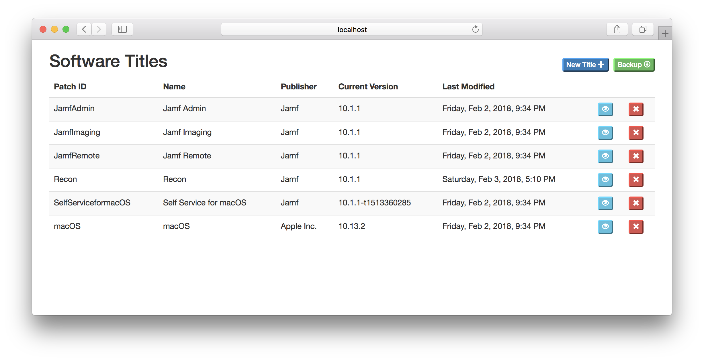
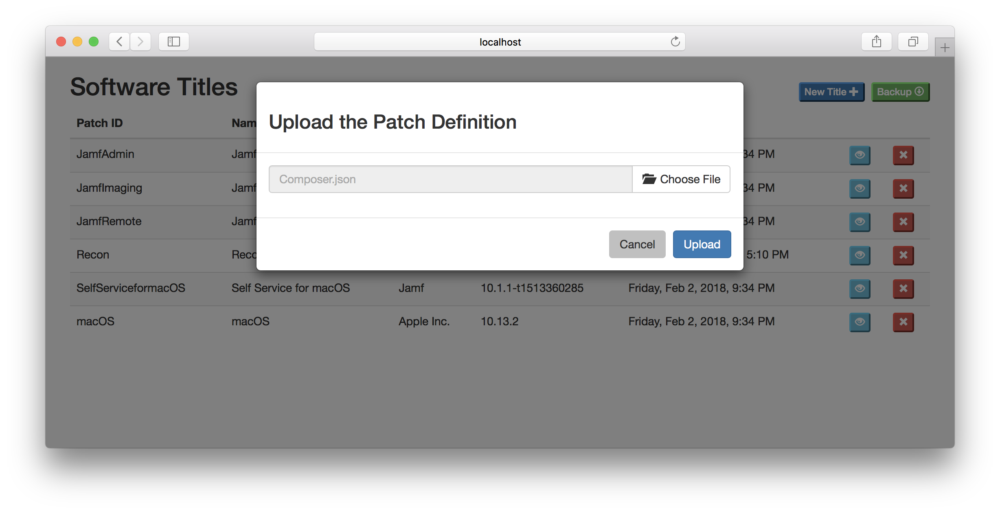
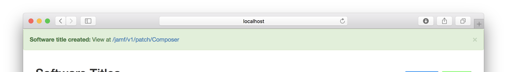
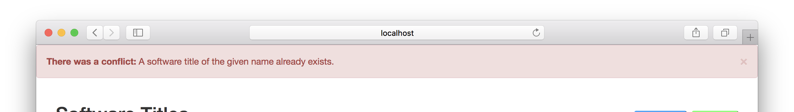
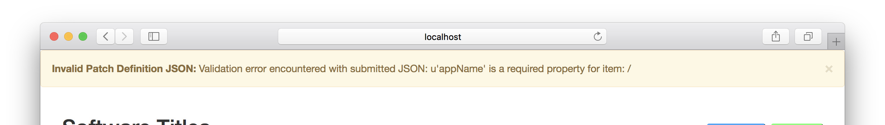
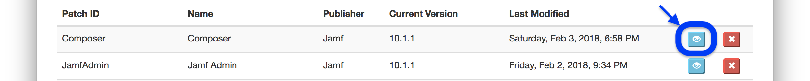
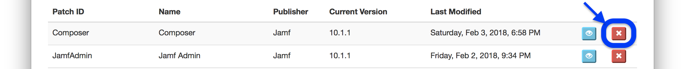
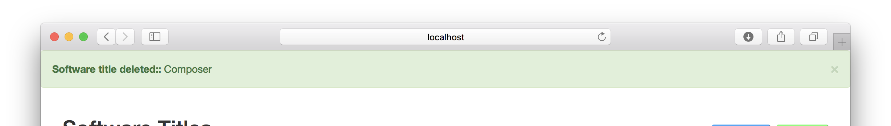
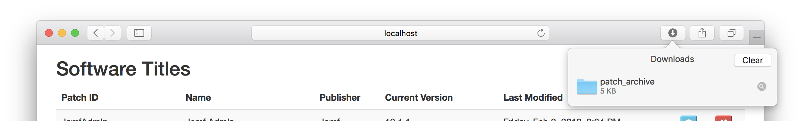
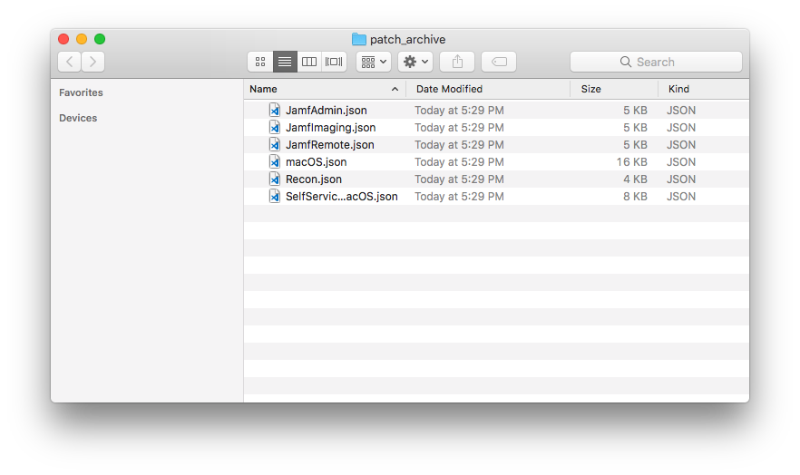

.. Patch Server for Jamf Pro documentation master file, created by
   sphinx-quickstart on Fri Feb  2 12:00:28 2018.
   You can adapt this file completely to your liking, but it should at least
   contain the root `toctree` directive.

Patch Server for Jamf Pro
=========================

An open-source implementation of an external patch source for use with Jamf Pro
(version 10.2+).

.. contents::
   :depth: 2
   :local:

.. toctree::
   :maxdepth: 1

   change_history

.. toctree::
   :maxdepth: 1
   :caption: Managing Your Patch Server

   managing/patch_starter

.. toctree::
   :maxdepth: 1
   :caption: Setup Instructions

   setup/testing
   setup/docker
   setup/macOS
   setup/ubuntu
   setup/in_jamf_pro

.. toctree::
   :maxdepth: 1
   :caption: API Documentation

   apis/auth
   apis/ps_api
   apis/jamf_pro

User Interface
--------------

In a browser, the root of the patch server will take you to the main page where
you can view and manage the available software titles.

Upload a New Software Title
^^^^^^^^^^^^^^^^^^^^^^^^^^^

Click the **New Title** button to bring up the file selector. Browse for the
JSON file of the patch definition and then click **Upload**.

You will recieve a confirmation of a successful upload.

Upload Errors
^^^^^^^^^^^^^

If the patch server rejects your upload of a patch definition, it will provide
a notification with the reason so you can correct the cause and retry.

There is a conflict with an existing software title.

The patch definition failed validation, but the cause is displayed.

View a Patch Definition
^^^^^^^^^^^^^^^^^^^^^^^

Click the blue **View** icon for a software title to be taken to the URL of the
patch definition JSON.

Delete a Software Title
^^^^^^^^^^^^^^^^^^^^^^^

Click the red **X** button for a software title to delete it.

.. warning::

   This action cannot be undone.

Backup Your Patch Definitions
^^^^^^^^^^^^^^^^^^^^^^^^^^^^^

Click the **Backup** button and you will download a zipped archive of all patch
definitions for all your software titles.

.. note::

   This is a feature of the API that you can use with automation for scheduled
   backups of the server.

Webhooks
^^^^^^^^

The patch server can send notifications on changes to software titles on the
server to remote servers via *HTTP POST*. To configure a webhook, click the
**New Webhook** button to bring up the configuration screen. Enter the remote
**URL** and select from the available options:

- **Enabled:** Enable or disable this webhook.
- **Verify SSL:** Enable or disable SSL verification (HTTPS).
- **Send Definition:** When an event is sent, include a fully copy of the entire patch definition for the software title.
