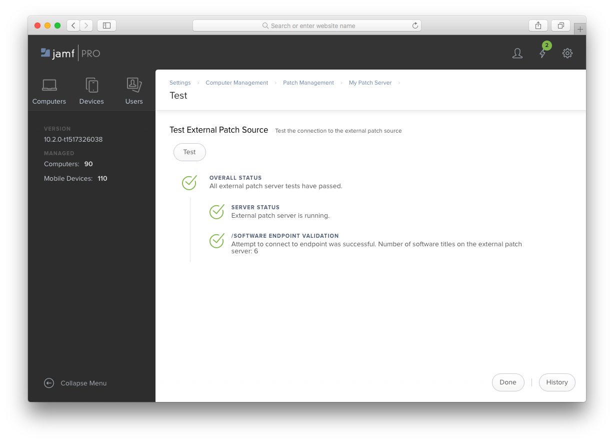

Troubleshooting
---------------

If you encounter issues between Jamf Pro and your Patch Server you can
investigate using the resources detailed here.

Jamf Pro's Connection Test
^^^^^^^^^^^^^^^^^^^^^^^^^^

Jamf Pro has a test option to verify it can contact the Patch Server and read
software titles. In Jamf Pro, go to **Settings > Computer Management > Patch**
**Management > <Your Patch Server>** in the management console.

Click the **Test** button at the bottom of the page.

Jamf Pro Logs
^^^^^^^^^^^^^

If you enable ``DEBUG`` mode for Jamf Pro logging, you can search for entries
with ``SoftwareTitleMonitor``. The debug statements will show when the sync
occurs, what titles are being requested, and the error encountered.
