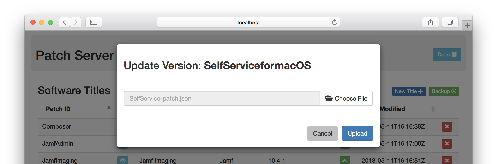

# User Interface

In a browser, the root of the patch server will take you to the main page where you can view and manage the available software titles.

## Upload a New Software Title

Click the **New Title** button to bring up the file selector. Browse for the JSON file of the patch definition and then click **Upload**.

You will recieve a confirmation of a successful upload.

### Upload Errors

If the patch server rejects your upload of a patch definition, it will provide a notification with the reason so you can correct the cause and retry.

There is a conflict with an existing software title.

The patch definition failed validation, but the cause is displayed.

## Update a Title's Version

Click the green **Up** icon for a title to display a file prompt. Select the JSON file containing the new version data and submit it.

You will receive a confirmation of a successful upload.

You will also receive similar feedback for errors as with creating new titles.

## Other Title Actions

There are additional actions available for each software title.

- The blue **View** icon will take you to the URL of the patch definition JSON.
- The red **X** icon will delete the title from the server.

> :warning: The delete action cannot be undone.

## Backup Patch Definitions

Click the **Backup** button and you will download a zipped archive of all patch
definitions for all your software titles.

> :information_source: This is a feature of the API that you can use with automation for scheduled backups of the server.

