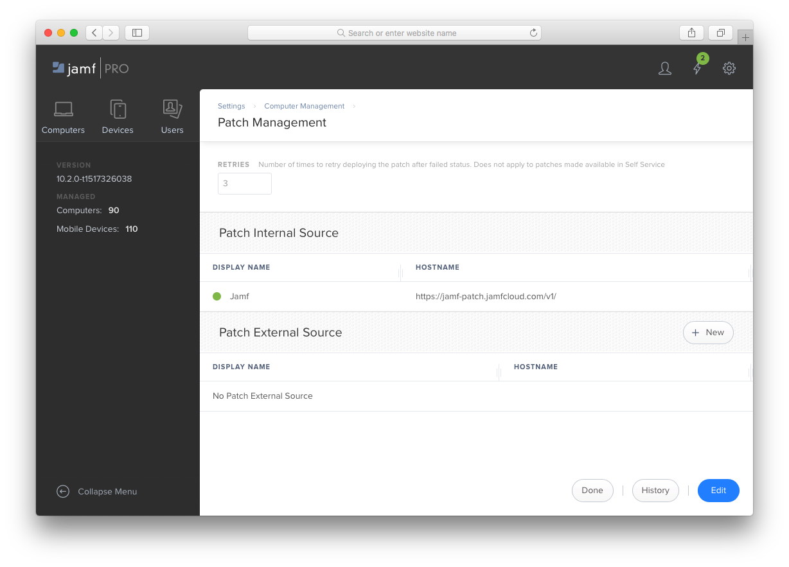
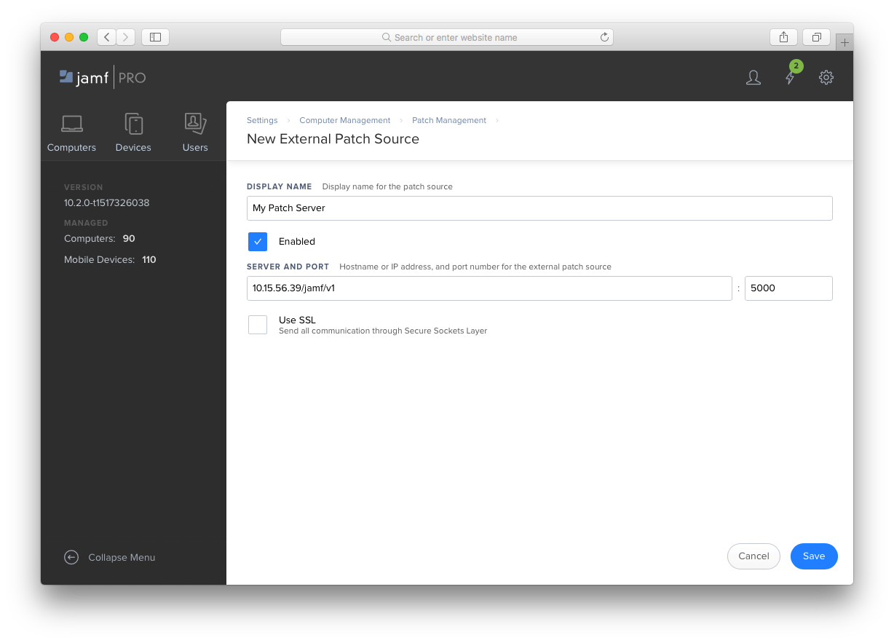
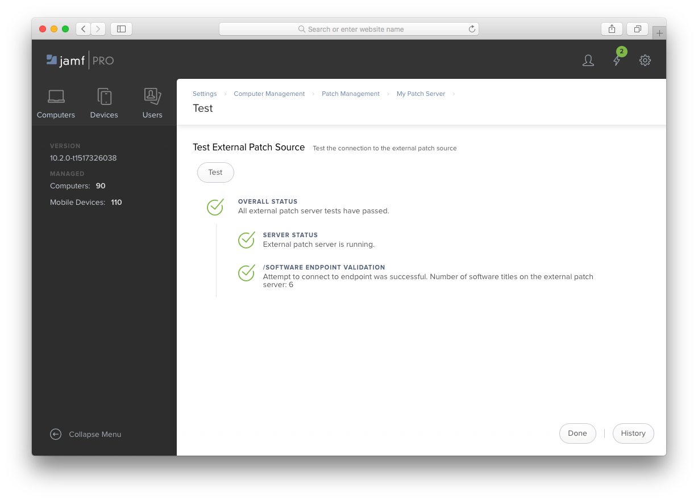
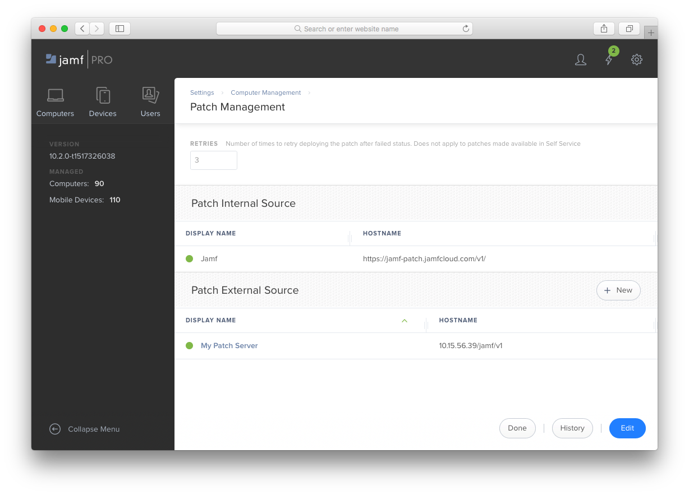
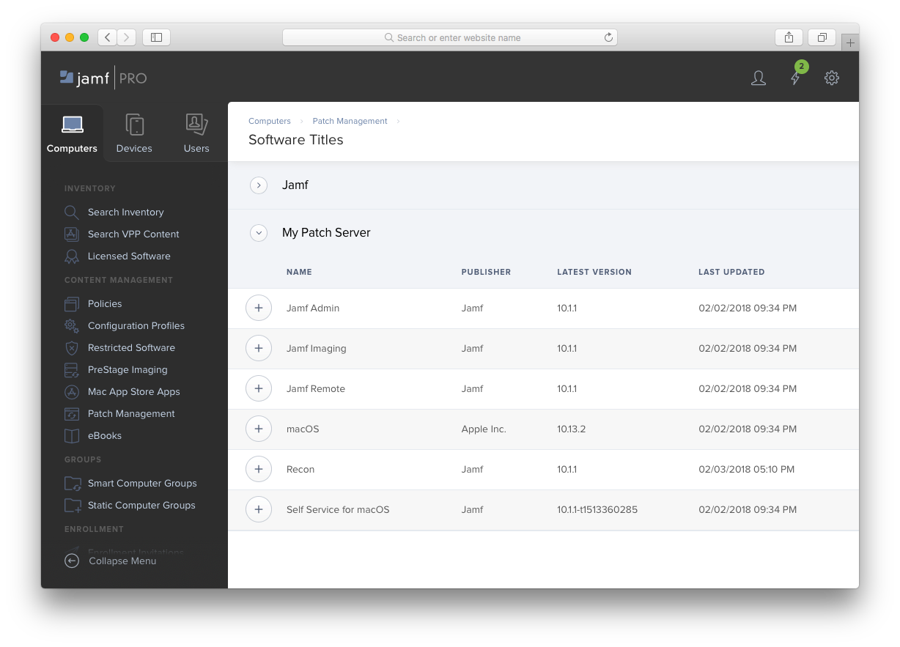

# Setup Patch Server in Jamf Pro

Configure the Patch Server as an External Patch Source in Jamf Pro.

> :information_source: External Patch Sources is a feature of Jamf Pro v10.2+.

To add your Patch Server as a **Patch External Source** in Jamf Pro, go to **Settings > Computer Management > Patch Management** in the management console.



Click the **+ New** button next to **Patch External Source**. On the next screen assign a name to your Patch Server. In the **SERVER** field enter the URL without with the schema or port and append `/jamf/v1`:

```text
<server-IP-or-hostname>/jamf/v1
```

In the **PORT** field enter `5000` (or alternatively, the the port you configured during setup).

> :information_source: Only check the **Use SSL** box if you have configured a TLS certificate and are serving traffic over HTTPS from your Patch Server. If you are using HTTP leave this box unchecked.



After saving your settings, a **Test** button will be available on the Patch Server's page. Click it to verify Jamf Pro can connect to your Patch Server and data is being received.



Your Patch Server will now be displayed on the **Patch Management** settings
page.



You will now be able to add your software titles on your Patch Server from the **Computers > Patch Management > Software Titles** list.


